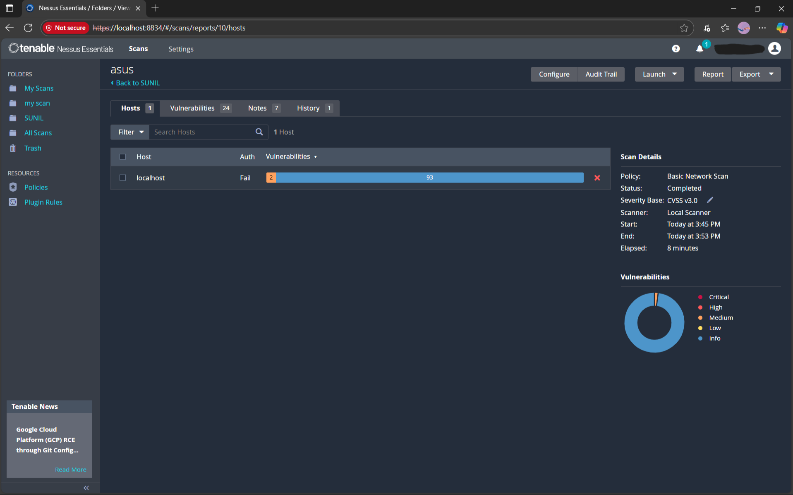
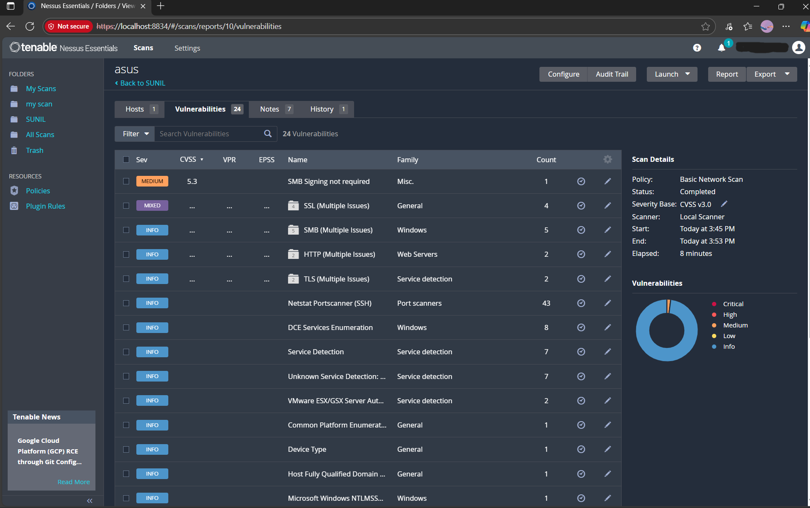

# Cybersecurity-Internship-Task-3
Task 3 : Perform a Basic Vulnerability Scan on Your PC

# Vulnerability Scan & Analysis Report

This document details the submission for Task 3, focusing on the analysis, documentation, and mitigation research for vulnerabilities identified on a local PC.

### Tools & Target
* **Scanner:** Nessus Essentials
* **Scan Policy:** Basic Network Scan
* **Target:** `localhost` (127.0.0.1)

---

## 1. Review of Report for Vulnerabilities and Severity 

A "Basic Network Scan" was successfully executed against the `localhost` target. The scan completed in 8 minutes.

The report was reviewed, and the following severity profile was identified:
* **Critical:** 0
* **High:** 0
* **Medium:** 2 (One listed as 'Medium', one as 'Mixed')
* **Info:** 93

**Conclusion of Review:** The system is not exposed to any immediate Critical or High-risk vulnerabilities. The primary areas for improvement fall within the 'Medium' severity category.

---

## 2. Documentation of the Most Critical Vulnerability 

Based on the review, the most critical vulnerability identified is:

* **Vulnerability:** `SMB Signing not required`
* **Severity:** **Medium**
* **CVSS Score:** 5.3
* **Description:** The scan detected that the Server Message Block (SMB) service running on the host does not require message signing. This configuration is vulnerable to man-in-the-middle (MitM) attacks. An attacker on the same network could intercept and modify SMB packets, potentially capturing credentials or executing malicious commands.

---

## 3. Research on Simple Fixes or Mitigations 

Simple mitigation steps were researched for the documented `SMB Signing not required` vulnerability:

* **Recommended Fix:** Enforce SMB Signing via Group Policy.
* **Steps to Mitigate:**
    1.  Open the **Local Group Policy Editor** by running `gpedit.msc`.
    2.  Navigate to the following path:
        `Computer Configuration \ Windows Settings \ Security Settings \ Local Policies \ Security Options`
    3.  Locate the following two policy settings:
        * `Microsoft network client: Digitally sign communications (always)`
        * `Microsoft network server: Digitally sign communications (always)`
    4.  Set both of these policies to **"Enabled"**.
    5.  Run `gpupdate /force` from a command prompt or restart the computer to apply the changes. This will force all SMB communication to be digitally signed, preventing the identified MitM attack vector.

---

## 4. Scan Evidence (Screenshots)

The following screenshots validate the scan execution and the findings.

### Scan Summary
*This image shows the overall scan results, target, and severity chart.*

### Detailed Vulnerability List
*This image lists the specific vulnerabilities found, with the 'Medium' severity finding at the top.*

